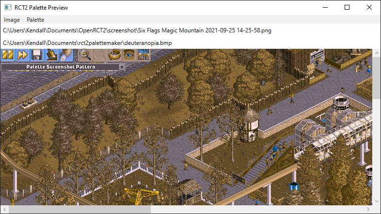

# RCT2 Palette Preview

This project is a tool for taking existing RCT2 screenshots and rendering them using a different palette.

## Features

### 1. Load images

Images can be loaded from files or pasted from the clipboard. When an image is loaded, it is converted to an 8-bit image as follows:

1. If it's already in an 8-bit format, it will ask you if you want to use the existing palette. If you say no, it will move on to the next steps.
2. If it detects the Palette Screenshot Pattern in the screenshot, it will use that to determine the palette.
3. Otherwise, it will ask you to select a palette manually, and it will use that palette to convert to image to an 8-bit format.

### 2. Load palettes

Palettes can be loaded from PNG and BMP images, .DAT palette files, and OpenRCT2 JSON palette files.

### 3. Preview images

Once both an image and a palette are loaded, the image will be rendered using the palette.

### 4. Save images

The rendered image can be saved to a file or copied to the clipboard.

### 5. Save palettes

The loaded palette can be saved as a JSON palette file that can be placed in OpenRCT2's object folder and used in the game.

### 6. Choose the weather palette

Each palette has three variations depending on the weather. You can choose which one is used to render the image. This ONLY affects how water is animated. A screenshot taken in the rain cannot be converted to sunny weather.

## Included Files

### palettescreenshotpattern.js

This is an OpenRCT2 plugin that can display the current palette on the screen, which RCT2 Palette Preview will recognize if it finds it in a screenshot.

### liminal.json

This is an OpenRCT2 palette that's specifically designed to avoid issues with duplicate/ambiguous colours. Screenshots taken with this palette will not have these issues.